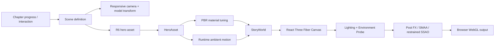

# Convalt Energy — Interactive 3D Infrastructure Narrative

A production-grade, browser-based 3D storytelling experience for **Convalt Energy**, built with **Next.js, React Three Fiber, Three.js, TypeScript, GSAP, Zustand, Python/Trimesh asset tooling, and Render**.

The experience presents six cinematic infrastructure chapters—integrated campus, solar manufacturing, power generation, data centers, recycling, and connected campus—through real-time WebGL scenes rather than a conventional flat landing page.

> Live production: https://convalt-energy-r612-prod.onrender.com/

---

## Table of contents

- [Overview](#overview)
- [Experience structure](#experience-structure)
- [Six hero scenes](#six-hero-scenes)
- [Technical stack](#technical-stack)
- [Rendering architecture](#rendering-architecture)
- [Asset pipeline](#asset-pipeline)
- [Repository structure](#repository-structure)
- [Local development](#local-development)
- [Environment variables](#environment-variables)
- [Build and deployment](#build-and-deployment)
- [Quality assurance](#quality-assurance)
- [Performance and fallback behavior](#performance-and-fallback-behavior)
- [R6 asset conventions](#r6-asset-conventions)
- [Current visual pipeline](#current-visual-pipeline)
- [Troubleshooting](#troubleshooting)
- [Change-safety rules](#change-safety-rules)
- [Project provenance](#project-provenance)
- [About](#about)

---

## Overview

This repository implements an immersive corporate narrative around large-scale energy infrastructure. The visual language combines:

- architectural visualization;
- procedural industrial modeling;
- cinematic camera choreography;
- responsive WebGL composition;
- chapter-based interaction;
- physically based materials;
- real-time shadows and reflections;
- procedural asset generation;
- deterministic LOD/proxy generation;
- mobile and WebGL-unavailable fallbacks;
- production QA and release evidence.

The current production experience is intentionally **interaction-led rather than a static scroll gallery**. The WebGL world and editorial copy are coordinated chapter by chapter.

The application ships as a Next.js web app and uses generated GLB assets under the R6 asset set.

---

## Experience structure

The story is organized into six scenes configured in:

`experience/config/scenes.ts`

Each scene defines:

- a semantic chapter ID;
- title/label;
- timeline range;
- hero asset;
- desktop/tablet/mobile camera shot;
- model position, rotation, and scale;
- accent and background palette;
- fog distances;
- key and rim light settings.

The six chapters are:

1. Integrated platform
2. Solar manufacturing
3. Power generation
4. Data centers
5. Recycling
6. Connected campus / project pipeline

The current runtime uses the R6 semantic hero map:

```text
hero-campus        -> integrated-campus
manufacturing      -> manufacturing-line
power-generation   -> substation-bess
data-centers       -> data-center-cooling
recycling          -> recycling-intake
closing-platform   -> connected-campus
```

---

## Six hero scenes

| Chapter | R6 hero ID | Visual role |
|---|---|---|
| Integrated platform | `integrated-campus` | Combined campus, solar, electrical infrastructure, landscape, and animated turbines |
| Solar manufacturing | `manufacturing-line` | High-bay industrial manufacturing, conveyors, process equipment, gantry motion, glazing, rooftop plant |
| Power generation | `substation-bess` | Solar field, substation, transformer systems, BESS infrastructure, animated turbines |
| Data centers | `data-center-cooling` | Data-center envelope, cooling plant, pipework, rooftop systems, service infrastructure |
| Recycling | `recycling-intake` | Sorting and recovery hall, conveyors, drums, baling/process zones, industrial service structure |
| Connected campus | `connected-campus` | Multi-building connected infrastructure campus with utilities and renewable energy systems |

Each hero is available through an R6 LOD family:

```text
public/models/r6/hero/<hero-id>/
  lod0.glb
  lod1.glb
  lod2.glb
  proxy.glb
```

The production scene configuration currently presents LOD0 for the primary hero experience while the lower-detail assets remain part of the validated pipeline.

---

## Technical stack

### Front end

- **Next.js 16**
- **React 19**
- **TypeScript 5**
- **React Three Fiber 9**
- **Three.js 0.185**
- **GSAP 3**
- **Zustand 5**
- Inter and DM Sans variable fonts

### 3D / asset generation

- Python 3
- Trimesh
- NumPy
- SciPy
- Pillow
- GLB / glTF
- KTX2 material textures
- deterministic proxy reduction

### Runtime / hosting

- Node.js 22
- npm 10
- Render web service
- GitHub-based source control and CI

---

## Rendering architecture

The major runtime flow is:



Key runtime components include:

- `components/experience/ExperienceCanvas.tsx`
- `components/experience/StoryWorld.tsx`
- `components/experience/HeroAsset.tsx`
- `components/experience/R6AmbientMotion.tsx`
- `components/experience/EnvironmentProbe.tsx`
- `components/experience/R6PostFX.tsx`

### Material behavior

The runtime distinguishes between:

- painted metal;
- exposed steel;
- aluminum;
- concrete;
- rubber;
- architectural facade surfaces;
- transparent industrial glazing;
- emissive/glow materials.

Manufacturing receives its dedicated R6.1 material texture family while other heroes use the shared R6 hero texture pipeline.

### Lighting and reflections

The experience uses:

- ACES filmic tone mapping;
- controlled exposure;
- dynamic key/rim lighting;
- chapter-specific background/fog;
- environment probes with sky and softbox geometry;
- high-quality shadow rendering;
- restrained SSAO in compatible high-quality paths;
- SMAA post-processing.

---

## Asset pipeline

The project does not rely only on static hand-exported 3D files. A significant portion of the environment is built and validated procedurally.

The production prebuild executes:

```bash
bash scripts/prepare-render-r612-assets.sh
```

That pipeline performs the following major operations:

1. Build the clean R6 context layer.
2. Remove overlapping legacy geometry that could cause z-fighting.
3. Recreate/verify the manufacturing visual master.
4. Verify manufacturing source identity.
5. Build R6 runtime hero assets.
6. Generate and validate LOD/proxy assets.
7. Prove CPU fallback generation.
8. Validate the final runtime asset set.

The clean-context generator is:

```text
scripts/generate-r617-clean-context.py
```

The clean-context policy keeps useful landscape/infrastructure context while preventing legacy R4/R5 masses from being stacked under R6 replacement architecture.

This is important because overlapping near-coplanar geometry can produce visible flicker, shimmer, or z-fighting.

---

## Repository structure

A simplified map of the repository:

```text
.
├── app/                         # Next.js application routes
├── components/
│   └── experience/              # WebGL runtime components
├── experience/
│   ├── config/                  # scenes, assets, materials, story motion
│   └── systems/                 # runtime activation/performance systems
├── assets-source/
│   └── r6/
│       └── authoring/           # procedural hero authoring logic
├── public/
│   ├── models/                  # generated GLB assets
│   ├── textures/                # R6/KTX2 textures
│   └── fallback/                # static fallback imagery
├── scripts/                     # generators, validators, release tooling
├── tools/                       # proxy/asset utilities
├── tests/                       # Node and Python regression tests
├── artifacts/                   # QA/release evidence when generated
├── .github/workflows/           # CI and cinematic QA workflows
├── render.yaml                  # Render production service definition
└── package.json                 # application and QA command surface
```

---

## Local development

### Requirements

Use the versions expected by the repository:

- Node.js: **>=22 <23**
- npm: **>=10 <11**
- Python 3 for procedural asset/release tasks

Recommended Node version:

```text
22.18.0
```

### Install

```bash
git clone https://github.com/adnanPBI/interactive-3D-real-estate-narrative.git
cd interactive-3D-real-estate-narrative
npm ci
```

### Start development mode

```bash
npm run dev
```

Then open:

```text
http://localhost:3000
```

### Type checking

```bash
npm run typecheck
```

### Production build

```bash
npm run build
npm start
```

---

## Environment variables

The production Render configuration defines the following important variables:

| Variable | Production value / role |
|---|---|
| `NODE_VERSION` | `22.18.0` |
| `DEPLOYMENT_TIER` | `production` |
| `NEXT_PUBLIC_3D_ASSET_SET` | `r6` |
| `NEXT_PUBLIC_BRAND_ASSET_SET` | `stage4` |
| `NEXT_PUBLIC_ALLOW_INDEXING` | `0` |
| `ENABLE_ACCEPTANCE_QA` | `1` |
| `ENABLE_VISUAL_QA` | `0` |

For local development, R6 is the normal asset target.

---

## Build and deployment

Production deployment is described in `render.yaml`.

The Render service is configured to:

- deploy from `main`;
- auto-deploy new main commits;
- run on Node.js;
- install dependencies with `npm ci`;
- prepare the procedural R6 runtime assets;
- perform the Next.js production build;
- run the app with `npm start`;
- expose a root health check.

Current production URL:

https://convalt-energy-r612-prod.onrender.com/

### Render build chain

The key build path is effectively:

```text
npm ci
  -> prebuild
      -> prepare-render-r612-assets.sh
      -> generate build metadata
      -> assert R6 runtime assets
  -> next build
  -> npm start
```

Because R6 hero files are generated/verified during production preparation, changes to procedural source files can materially change the deployed GLBs even when no binary GLB is committed manually.

---

## Quality assurance

The repository contains multiple validation layers.

### Core checks

```bash
npm run typecheck
npm test
npm run build
```

### R6 QA

```bash
npm run qa:r6
```

This includes source, texture, runtime, proxy, CPU-fallback, and rendering-contract validation.

### Six-chapter proof

```bash
npm run qa:r6:six-chapter
```

### WebGL fallback proof

```bash
npm run qa:r6:fallback-runtime
```

### Production QA

```bash
npm run qa:production
```

### Release checks

The repository also exposes staged release commands including:

```bash
npm run release:freeze
npm run release:cutover-ready
npm run release:finalize
```

### Cinematic regression workflow

The GitHub Actions cinematic workflow validates:

- TypeScript;
- production-equivalent asset generation;
- cinematic material/render contracts;
- geometry regressions;
- manufacturing source identity;
- no-flicker/z-fighting regressions;
- six-chapter browser capture;
- CPU fallback evidence.

Workflow definition:

`.github/workflows/cinematic-heroes.yml`

---

## Performance and fallback behavior

The application includes multiple safeguards for real-world browsers.

### Performance controls

- quality tiers;
- bounded DPR;
- runtime performance governor;
- asset activation logic;
- scene-level LOD infrastructure;
- shadow budget controls;
- optimized render passes;
- deterministic proxy generation.

### WebGL failure handling

If the browser loses the WebGL context, the runtime dispatches a fatal WebGL event and can fall back to the static experience.

The repository contains dedicated fallback assets and acceptance tests for this path.

### Reduced motion

Animated process systems respect reduced-motion behavior so users can receive a stable presentation without unnecessary mechanical motion.

---

## R6 asset conventions

### Semantic hero IDs

Use these exact IDs for R6 runtime work:

```text
integrated-campus
manufacturing-line
substation-bess
data-center-cooling
recycling-intake
connected-campus
```

### Do not stack replacement architecture

When an R6 hero replaces a legacy architectural mass, that old mass must be filtered from the context layer.

Do not solve visual flicker by merely changing camera distance or material opacity. Check first for duplicate or near-coplanar geometry.

### Roads, vehicles, and unwanted context

The production context generator explicitly suppresses road/vehicle helpers where they conflict with the final composition.

For example, the integrated-campus hero intentionally excludes the former rear water strip because it visually read as a long access road behind the hero in the production camera.

### Turbines

Static legacy turbines are suppressed where runtime turbines are used. Runtime turbine positions are defined in `R6AmbientMotion.tsx`.

### Data-center fans

Do not reintroduce the old floating data-center runtime fan overlay. Cooling equipment is authored in the hero model and should stay spatially grounded.

---

## Current visual pipeline

The current codebase combines several revision layers:

- package/release naming retains the **R6.1.2** production identity;
- the cinematic runtime includes subsequent R6.1.5/R6.1.6 material and lighting refinements;
- clean-context and no-flicker geometry corrections are implemented in the **R6.1.7** asset preparation path.

The active production asset set remains:

```text
NEXT_PUBLIC_3D_ASSET_SET=r6
```

This distinction matters when reviewing historical commits or older validation scripts.

---

## Troubleshooting

### Hero is not visible

Check, in order:

1. `NEXT_PUBLIC_3D_ASSET_SET=r6`
2. production prebuild completed successfully;
3. `public/models/r6/hero/<hero>/lod0.glb` exists after the build;
4. browser network requests for GLB/KTX2 assets return 200;
5. no WebGL fatal event occurred;
6. `window.__CONVALT_ACTIVE_HERO__` reports the expected hero;
7. camera/model transforms in `experience/config/scenes.ts` are still valid.

### Hero flickers or blinks

Typical causes:

- duplicated architectural shell;
- R4/R5/R6 geometry occupying nearly identical coordinates;
- transparent surfaces writing depth incorrectly;
- pipe racks or rails intersecting a new replacement system;
- runtime geometry layered on top of an authored equivalent.

Inspect geometry ownership before applying cosmetic fixes.

### Model looks too dark

Review:

- ACES exposure;
- environment probe availability;
- material roughness/metalness;
- texture color-space assignment;
- SSAO contribution;
- whether a texture is being multiplied by an unintended dark material tint.

### Render build differs from local development

Remember that the Render build invokes `prepare-render-r612-assets.sh` during the prebuild. Local development that skips that generation path may not represent the final production GLBs.

---

## Change-safety rules

For future 3D work:

1. Preserve chapter IDs and semantic hero IDs.
2. Avoid duplicate source-of-truth geometry.
3. Keep asset generation deterministic.
4. Do not reintroduce legacy roads, vehicles, or static turbines without checking the production composition.
5. Validate transparent material depth behavior.
6. Keep LOD2/proxy provenance intact.
7. Run typecheck, asset validation, geometry regressions, and browser QA before production deployment.
8. Treat desktop and mobile framing as separate acceptance surfaces.
9. Do not interpret software-renderer timings as physical-device FPS certification.
10. Keep fallback paths operational.

---

## Project provenance

The procedural environments in this repository are **visual-development architectural scenes**, not engineering CAD/BIM models and not a representation of surveyed as-built site geometry.

They are designed to communicate infrastructure systems and corporate narrative in a cinematic real-time web experience.

Where exact project, engineering, safety, regulatory, or construction information is required, use approved source data rather than the visual-development geometry in this repository.

---

## About

For a concise project description, goals, design principles, scene catalog, and technical philosophy, see [ABOUT.md](ABOUT.md).

---

## Repository

**GitHub:** https://github.com/adnanPBI/interactive-3D-real-estate-narrative  
**Production:** https://convalt-energy-r612-prod.onrender.com/

Maintained as an interactive 3D architectural narrative and real-time infrastructure visualization project.
